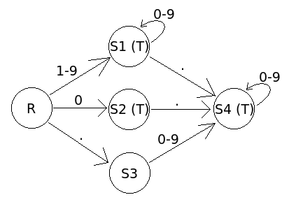
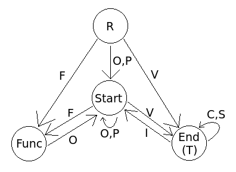

# CPPND Capstone Project - Calculator

This is a capstone project for the C++ Nanodegree Course offered by Udacity. This project aims to build a calculator in C++. It is designed in such a way that any new functions / operators / constants could be added to the vocabulary easily.

## Dependencies

- [CMake](https://cmake.org/) (>= 3.12): For project building.
- [cxxopts](https://github.com/jarro2783/cxxopts): For command line argument parsing.
- [yaml-cpp](https://github.com/jbeder/yaml-cpp): For YAML config parsing.

## Usage

Compile and run the project as follows:

```bash
$ mkdir build && cd build
$ cmake .. 
$ make
$ ./calc
```

Usage of the executable is as follows:

```
calc [-n num-config] [-g grammar-config]
```

- `<num-config>`: Path to the YAML file containing the configuration of numeral token parsing finite state machine graph. Defaults to `data/numeral.yaml`.
- `<grammar-config>`: Path to the YAML file containing the configuration of grammar parsing finite state machine graph. Defaults to `data/grammar.yaml`.

## Design

The calculator mainly consists of three components -- tokenizer, parser and user interface. A string of math expression is first accepted from the user interface. It is then split into tokens by the tokenizer. The tokens are then parsed into an abstract syntax tree for expression evaluation. Finally, the result is returned through the user interface.


### Tokenizer

The tokenizer is responsible for splitting the input string into recognized tokens. A token can be either a literal number (e.g.: `.427`, `3`, ...) or a symbol (e.g.: `e`, `pi`, `sin`, `cos`, ...). For instance:

```
input = ".368*sin(pi/3) - 4. / cosh(pi/4)"
output = [".368", "*", "sin", "(", "pi", "/", "3", ")", "-",
          "4.", "/", "cosh", "(", "pi", "/", "4", ")"]
```

A finite state machine (FSM) is used to parse the tokens.

### Expression Parser

The expression parser performs the following operations:

1. Grammar check
2. Expression parsing

The grammar check is done by another FSM where each token is mapped to its `SyntaxType` with the current grammar FSM state. The `SyntaxType` will then be used for updating the grammer graph state, its `SymbolType` is also recorded for `Node` creation.

After the grammar check, the list of recorded `SymbolType` is used to create the corresponding `Node`s for each of the tokens. The expression parsing operation uses this [algorithm](https://www.rhyscitlema.com/algorithms/expression-parsing-algorithm/). The parse procedure can be summarized as an iteration of the following:

1. Find the appropriate parent for the new node
2. Update the tree by the new node

The actual condition and operation of where and how the update should take place depend on the type of the new node at the iteration. For this reason, instead of type checking on every iteration, it is dealt with polymorphism where the actual behaviour is determined through dynamic binding. Therefore, the parse algorithm is embedded in the definition of each of the nodes.

### User Interface

In this project, a shell user interface is provided. It is similar to Python's interactive shell, where a prompt is provided for user input, with the result printed on stdout after hitting return. The next prompt will then be available for the next input. This read-eval-print loop ([REPL](https://en.wikipedia.org/wiki/Read%E2%80%93eval%E2%80%93print_loop)) will continue until the user quits by pressing `Ctrl + C`.

## Configuration Files

A configuration file is required for both the numeral token and grammar parsing.

The structure of the configuration files are as follows:

```yaml
"states":
  - {"id": "name_of_state_1", "terminal": true}
  - {"id": "name_of_state_2", "terminal": false}
  - ...
"transitions":
  - {"src": "src_state_name", "dst": "dst_state_name", "transitions": "each character is a transition"}
  - {"src": "empty string represents root", "dst": "root cannot be destination", "transitions": "..."}
  - ...
```

### Numeral Config

The given numeral config defines a finite state machine (sub-)graph of the following:



where `R` is the root state, and states with `T` indicates its a terminal state. See the [numeral config](./data/numeral.yaml) for definition.

### Grammar Config

The given grammar config defines a finite state machine graph of the following:



Here is a list of `SyntaxType`s each of the transition character corresponds to:

- `O`: Open Bracket
- `C`: Close Bracket
- `P`: Prefix Operator
- `S`: Suffix Operator
- `I`: Infix Operator
- `V`: Value
- `F`: Function

Each element in the math expression corresponds to exactly one of the above `SyntaxType`s, depending on the context (i.e. state at the moment). Using the above grammar graph, the expression `.328 * sin(pi / 3) - - + 1` can be tagged as

```
Tags:   V  I  F  O  V I V C I P P V
Expr: .328 * sin ( pi / 3 ) - - + 1
```

See the [grammar config](./data/grammar.yaml) for definition.